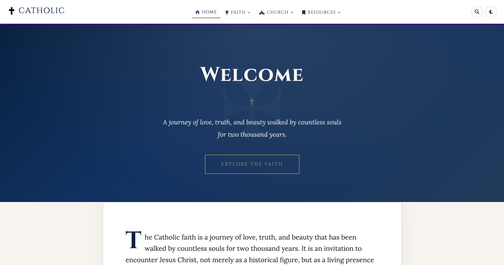

<div align="center">



# Catholic

**A reverent, beautifully crafted website for the Catholic faith — with daily Mass readings, liturgical calendars, and a rich introduction to Catholic belief and practice.**

[](https://github.com/noahweidig/catholic/actions/workflows/update_liturgical_day.yml)


*Ad Maiorem Dei Gloriam*

</div>

---

## Overview

This repository is a static Catholic faith website that serves as both an educational resource and a liturgical companion. Each day, it automatically fetches the official Mass readings from the United States Conference of Catholic Bishops (USCCB) and updates the site with the proper feast day, liturgical color, and readings for that day.

The site covers nine areas of Catholic life:

| Page | Content |
|---|---|
| **Home** | A reverent welcome to the faith |
| **Today** | Daily Mass readings and feast day |
| **Beliefs** | The Trinity, Eucharist, Mary, Saints, and more |
| **Sacraments** | All seven sacraments explained |
| **Prayer** | The Mass, the Rosary, and Catholic devotions |
| **History** | 2,000 years of Church history |
| **Structure** | The hierarchy and organization of the Church |
| **Apologetics** | Thoughtful answers to common questions |
| **Resources** | Books, links, and liturgical calendar subscriptions |

---

## Features

- **Automated daily readings** — GitHub Actions fetches the day's Mass readings from the USCCB every morning and commits them to the repository
- **Liturgical color theming** — The site header updates daily to reflect the proper liturgical color (green, purple, white, red, rose, or gold)
- **Downloadable ICS calendars** — Five liturgical calendar feeds for import into Apple Calendar, Google Calendar, Outlook, and more
- **Dark mode** — Persistent theme preference stored in localStorage
- **Site-wide search** — Keyboard-shortcut accessible (`Cmd/Ctrl+K` or `/`)
- **Fully accessible** — ARIA labels, skip links, screen-reader support, and semantic HTML throughout
- **Mobile responsive** — Hamburger menu and fluid layout for all screen sizes
- **Secure** — Content Security Policy, Subresource Integrity, referrer policy, and sanitized HTML updates

---

## Liturgical Calendars

Five ICS calendar files are generated and available for subscription:

| File | Contents |
|---|---|
| `litcal.ics` | Complete liturgical calendar |
| `holydays.ics` | Holy days of obligation only |
| `majorfeasts.ics` | Major feast days |
| `sundaysholydays.ics` | Sundays and holy days combined |
| `fastabstain.ics` | Days of fasting and abstinence |

These files can be imported into any calendar application that supports the ICS format.

---

## Tech Stack

**Frontend**
- HTML5, CSS3, and vanilla JavaScript — no frameworks
- [Cinzel](https://fonts.google.com/specimen/Cinzel) & [Lora](https://fonts.google.com/specimen/Lora) typefaces from Google Fonts
- [Font Awesome](https://fontawesome.com/) icons via CDN with SRI integrity hash

**Backend / Automation**
- **Node.js ≥ 20** with [Romcal](https://github.com/romcal/romcal) for Roman Catholic liturgical calendar calculations
- **Python ≥ 3.12** with [`catholic-mass-readings`](https://pypi.org/project/catholic-mass-readings/) for USCCB readings
- **GitHub Actions** — daily workflow triggers at 12:01 AM Eastern

---

## Getting Started

### Prerequisites

- Node.js ≥ 20
- Python ≥ 3.12

### Install dependencies

```bash
npm install
pip install -r requirements.txt
```

### Generate liturgical calendars

```bash
node scripts/generate_calendar.js
node scripts/generate_holydays.js
node scripts/generate_major_feasts.js
node scripts/generate_sundays_holydays.js
node scripts/generate_fast_abstain.js
```

### Update today's readings manually

```bash
python scripts/update_today.py
```

This fetches today's liturgical info via Romcal and today's readings from the USCCB, then updates `index.html` and `today.html` in place.

---

## Automated Daily Updates

A [GitHub Actions workflow](.github/workflows/update_liturgical_day.yml) runs every day at 12:01 AM Eastern (5:01 AM UTC). It:

1. Sets up Node.js 20 and Python 3.12
2. Installs all dependencies
3. Runs `update_today.py`
4. Commits and pushes any changes to the repository automatically

No manual intervention is needed to keep daily readings current.

---

## Project Structure

```
catholic/
├── .github/workflows/
│   └── update_liturgical_day.yml   # Daily automation
├── images/
│   ├── cross-ornate.svg
│   └── favicon.svg
├── scripts/
│   ├── main.js                     # Frontend UI (dark mode, search, menu)
│   ├── liturgical_utils.js         # Easter, Ash Wednesday, fast day logic
│   ├── get_liturgical_info.js      # Today's feast and liturgical color
│   ├── generate_calendar.js        # Generate litcal.ics
│   ├── generate_fast_abstain.js    # Generate fastabstain.ics
│   ├── generate_holydays.js        # Generate holydays.ics
│   ├── generate_major_feasts.js    # Generate majorfeasts.ics
│   ├── generate_sundays_holydays.js
│   └── update_today.py             # Daily readings updater
├── styles/
│   └── main.css                    # Liturgical color theming, animations
├── tests/                          # Unit and integration tests
├── *.html                          # Site pages
├── *.ics                           # Calendar subscription files
├── package.json
└── requirements.txt
```

---

## Security

- **Content Security Policy** on every page restricts script and style sources
- **Subresource Integrity** hashes on all CDN-loaded resources
- **HTML escaping** in `update_today.py` prevents XSS from external reading content
- **Liturgical color validation** via regex before injection into HTML
- **External links** receive `rel="noopener noreferrer"` automatically via JavaScript

---

## Running the Tests

```bash
# JavaScript tests
node tests/test_liturgical_utils.js

# Python tests
python -m pytest tests/
```

---

## Contributing

Contributions that serve the mission of the site — clarity, accuracy, and reverence — are welcome. Please open an issue before submitting a pull request for anything beyond minor fixes.

---

<div align="center">

*"Late have I loved you, beauty so old and so new: late have I loved you."*
— St. Augustine

&copy; 2026 Catholic Faith

</div>
